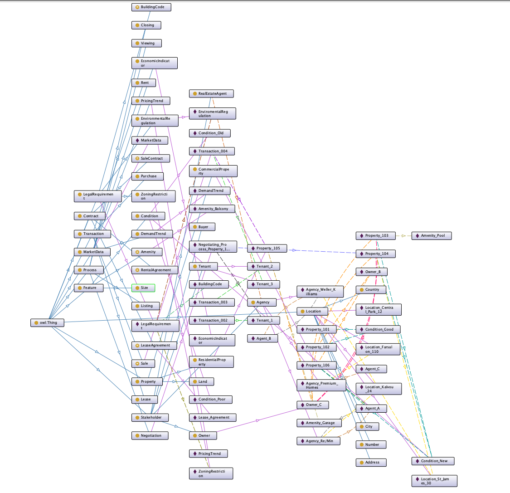

# 🏠 Real Estate Ontology

A semantic web ontology designed to model complex real estate systems, including properties, transactions, legal constraints, market data, and stakeholders. Built using **OWL**, **SPARQL**, and **Protégé**, this project aims to improve knowledge representation and reasoning in the real estate domain.

---

## 📌 Project Overview

The project models a comprehensive information system for real estate agencies using semantic technologies. It enables data consistency, reasoning, and advanced querying through a structured ontology defined in **OWL**.

- Represents contracts, property features, legal requirements, stakeholders, market trends, and transactions.
- Supports semantic reasoning and inference to automate knowledge extraction.
- Enables flexible SPARQL queries over structured RDF data.

---

## 🧠 Ontology Structure

### 🔹 Core Classes

- **Contract:** LeaseAgreement, RentalAgreement, SaleContract  
- **Feature:** Amenity, Condition, Location, Size  
- **LegalRequirement:** BuildingCode, EnvironmentalRegulation, ZoningRestriction  
- **MarketData:** DemandTrend, EconomicIndicator, PricingTrend  
- **Process:** Listing, Viewing, Negotiation, Closing  
- **Property:** ResidentialProperty, CommercialProperty, Land  
- **Stakeholder:** Owner, Buyer, Tenant, RealEstateAgent, Agency  
- **Transaction:** Lease, Rent, Sale, Purchase  

### 🔸 Object Properties

- `agreedByStakeholder`, `hasFeature`, `coversTransaction`, `governedByContract`
- `ownsProperty`, `participatesInTransaction`, `enforcedByAgency`, `relatedToTransaction`, etc.

### 🔸 Data Properties

- `contractID`, `featureValue`, `averagePrice`, `transactionAmount`, `constructionYear`, etc.

---

## 🛠️ Technologies Used

- **Protégé** – Ontology editor with HermiT reasoner  
- **OWL** – Web Ontology Language  
- **RDF/XML** – Ontology serialization format  
- **SPARQL** – Query language for RDF  
- **Visual Studio Code** – For organizing SPARQL and documentation files  

---

## 🧪 Reasoning & Inference Examples

- A `Property` with a `Rent` transaction implies involvement of a `Tenant`.  
- A `Stakeholder` who owns a `Property` is inferred as an `Owner`.  
- A `Property` with a `hasCondition` some `Condition` restriction must have an associated state.  

---

## 📊 Use Case Scenarios

- **Agent_A** (RealEstateAgent) works at **Agency_Re/Min** and manages transactions for **Property_101**.  
- **Owner_C** owns **Property_101**, which is rented to **Tenant_1**.  
- **Property_101** is defined by attributes like size, condition, price, and location (composed of City, Address, Country).  

---
